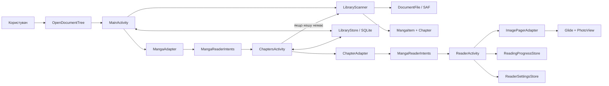

# Архітектура

## Огляд

Kiroku Manga Reader — одномодульний Android-застосунок на Kotlin із класичним
View-based UI. Застосунок читає локальну бібліотеку манґи через Android Storage
Access Framework, кешує знайдену структуру в SQLite і відкриває сторінки в
`ViewPager2` із масштабуванням через `PhotoView`.

Головний користувацький шлях складається з трьох екранів:

```text
MainActivity -> ChaptersActivity -> ReaderActivity
 бібліотека       список глав        читання сторінок
```

Проєкт не використовує ViewModel, dependency injection або окремі Gradle-модулі.
Водночас базову бізнес-логіку вже винесено з Activity-класів у невеликі
компоненти:

- `LibraryScanner` відповідає за обхід SAF/`DocumentFile` і формування моделей.
- `LibraryStore` відповідає за SQLite-кеш бібліотеки.
- `ReadingProgressStore` відповідає за прогрес читання.
- `ReaderSettingsStore` відповідає за налаштування читача.
- `MangaReaderIntents` централізує navigation extras між екранами.
- `NaturalSort` і `ImageFileType` містять чисті правила сортування та фільтрації
  зображень.

## Потік даних



1. `MainActivity` відкриває системний picker директорії та зберігає read-дозвіл
   через `takePersistableUriPermission()`.
2. `MainActivity` запускає `LibraryScanner.scanLibrary()` на `Dispatchers.IO`.
3. `LibraryScanner` читає кореневу директорію через `DocumentFile`, знаходить
   директорії манґи, глави та сторінки, застосовує `NaturalSort` і
   `ImageFileType`.
4. Отримані `MangaItem` і `Chapter` зберігаються в SQLite через `LibraryStore`.
5. Під час наступного запуску `MainActivity` відновлює список манґи з
   `LibraryStore` без повторного обходу файлової системи.
6. Перехід до `ChaptersActivity` створюється через
   `MangaReaderIntents.chaptersIntent()`.
7. `ChaptersActivity` спершу пробує взяти глави з `LibraryStore`. Якщо кешу для
   вибраної манґи немає, екран запускає `LibraryScanner.scanChapters()` і
   зберігає результат назад у SQLite.
8. Перехід до `ReaderActivity` створюється через
   `MangaReaderIntents.readerIntent()`. У читач передається назва глави та
   список URI сторінок.
9. `ReaderActivity` показує сторінки через `ImagePagerAdapter`, `Glide` і
   `PhotoView`.
10. Поточна сторінка та статус прочитання зберігаються в `ReadingProgressStore`.
11. Ширина контейнера сторінки зберігається в `ReaderSettingsStore`.

## Компоненти

| Компонент | Відповідальність |
| --- | --- |
| `MainActivity` | UI бібліотеки, вибір директорії, запуск повного сканування, меню бібліотеки, показ прогресу читання по манґах, навігація до глав |
| `ChaptersActivity` | UI списку глав, відновлення або сканування глав, показ прогресу по главі, навігація до читача |
| `ReaderActivity` | `ViewPager2`, індикатор сторінки, fullscreen-панель, налаштування ширини сторінки, збереження прогресу |
| `LibraryScanner` | SAF-сканування бібліотеки, глав і сторінок; підтримка режиму one-shot без директорій глав |
| `LibraryStore` | читання, запис і очищення SQLite-кешу бібліотеки |
| `LibraryDatabaseSchema` | назви таблиць/колонок і створення SQLite-схеми |
| `ReadingProgressStore` | збереження останньої сторінки, прочитаних глав і агрегованого прогресу манґи |
| `ReaderSettingsStore` | збереження ширини контейнера сторінки в діапазоні `50%..200%` |
| `MangaReaderIntents` | типізовані фабрики `Intent` і парсинг navigation arguments |
| `NaturalSort` | природне сортування назв із числовими частинами |
| `ImageFileType` | список підтримуваних розширень зображень |
| `MangaAdapter` | відображення списку `MangaItem` |
| `ChapterAdapter` | відображення списку `Chapter` |
| `ImagePagerAdapter` | завантаження сторінок, налаштування масштабу та обробка touch-жестів |
| `MangaItem` | модель манґи: назва, URI директорії, глави, прогрес |
| `Chapter` | модель глави: назва, URI директорії, список URI сторінок, прогрес |

## Локальне зберігання

### SQLite-кеш бібліотеки

`LibraryStore` використовує `SQLiteOpenHelper` і схему з `LibraryDatabaseSchema`.
База має чотири таблиці:

| Таблиця | Призначення |
| --- | --- |
| `metadata` | службові значення, зокрема URI кореневої директорії |
| `manga` | список манґи |
| `chapters` | глави конкретної манґи |
| `pages` | URI сторінок конкретної глави |

Повний rescan очищає таблиці бібліотеки й записує актуальну структуру заново.
Очищення кешу бібліотеки не видаляє прогрес читання.

### Прогрес читання

`ReadingProgressStore` зберігає прогрес у `SharedPreferences` як JSON-об'єкт,
індексований за `chapterUri`. Запис містить:

- URI та назву манґи;
- URI та назву глави;
- індекс поточної сторінки;
- загальну кількість сторінок;
- ознаку завершення глави;
- час оновлення.

`getMangaProgress()` агрегує прогрес усіх глав конкретної манґи для показу
статусу в бібліотеці.

### Налаштування читача

`ReaderSettingsStore` зберігає ширину контейнера сторінки в
`SharedPreferences`. Допустимий діапазон: `50%..200%`, значення за замовчуванням:
`100%`.

## Навігаційний контракт

Навігація реалізована через явні `Intent`, але raw extras не розкидані по
Activity-класах. Вони інкапсульовані в `MangaReaderIntents`.

| Перехід | Фабрика | Дані |
| --- | --- | --- |
| `MainActivity` -> `ChaptersActivity` | `chaptersIntent()` | `manga_name`, `manga_uri` |
| `ChaptersActivity` -> `ReaderActivity` | `readerIntent()` | `title`, `images`, `manga_name`, `manga_uri`, `chapter_name`, `chapter_uri` |

Для дуже великих глав передавання всього списку URI сторінок через Binder може
стати обмеженням. Майбутній напрямок розвитку — передавати ідентифікатор глави,
а сторінки дочитувати в `ReaderActivity` із локального сховища.

## Конкурентність

- Activity-класи мають власний `CoroutineScope(Dispatchers.Main + Job())`.
- `MainActivity` запускає повне сканування бібліотеки на `Dispatchers.IO`.
- `ChaptersActivity` відновлює або сканує глави на `Dispatchers.IO`.
- `LibraryScanner` сканує манґи та директорії глав через `async(Dispatchers.IO)`.
- Результати повертаються на main thread для оновлення адаптерів.
- Scope скасовується в `onDestroy()`.

## Структура проєкту

Нижче наведено вихідні файли, важливі для архітектури. Згенеровані директорії
на кшталт `.gradle/`, `.idea/`, `.kotlin/` та `app/build/` не є частиною
вихідного коду.

```text
kiroku-manga-reader/
├── app/
│   ├── build.gradle.kts
│   └── src/
│       ├── main/
│       │   ├── AndroidManifest.xml
│       │   ├── java/com/crypset/kiroku/mangareader/
│       │   │   ├── MainActivity.kt
│       │   │   ├── ChaptersActivity.kt
│       │   │   ├── ReaderActivity.kt
│       │   │   ├── MangaAdapter.kt
│       │   │   ├── ChapterAdapter.kt
│       │   │   ├── ImagePagerAdapter.kt
│       │   │   ├── LibraryScanner.kt
│       │   │   ├── LibraryStore.kt
│       │   │   ├── LibraryDatabaseSchema.kt
│       │   │   ├── ReadingProgressStore.kt
│       │   │   ├── ReaderSettingsStore.kt
│       │   │   ├── MangaReaderIntents.kt
│       │   │   ├── MangaModels.kt
│       │   │   ├── ReadingProgressModels.kt
│       │   │   ├── NaturalSort.kt
│       │   │   └── ImageFileType.kt
│       │   └── res/
│       │       ├── drawable/
│       │       ├── layout/
│       │       ├── menu/
│       │       ├── mipmap-*/
│       │       ├── values/
│       │       └── xml/
│       └── test/
│           └── java/com/crypset/kiroku/mangareader/
│               └── NaturalSortTest.kt
├── docs/
│   ├── README.md
│   ├── DEVELOPMENT.md
│   ├── ARCHITECTURE.md
│   └── PRODUCT_CHECKLIST.md
├── gradle/
├── build.gradle.kts
├── gradle.properties
├── gradlew
├── gradlew.bat
├── LICENSE
├── README.md
└── settings.gradle.kts
```

## Ресурси інтерфейсу

| Layout/Menu | Призначення |
| --- | --- |
| `activity_main.xml` | toolbar бібліотеки, список манґи, empty/loading states і FAB вибору директорії |
| `activity_chapters.xml` | toolbar із назвою манґи, список глав, empty/loading states |
| `activity_reader.xml` | повноекранний `ViewPager2`, індикатор сторінки й кнопка налаштувань читача |
| `item_chapter.xml` | спільний item для манґи й глави |
| `item_manga_page.xml` | контейнер сторінки з `PhotoView` |
| `menu_main.xml` | очищення прогресу, зміна бібліотеки, rescan, очищення кешу |

## Межі та напрямки розвитку

Поточна структура вже прибирає основні god-класи з файлового сканування, але
залишається простою одно-модульною архітектурою. Найкорисніші наступні кроки:

1. Перенести стан екранів у ViewModel і використовувати lifecycle-aware
   coroutines.
2. Замінити JSON у `ReadingProgressStore` на DataStore або SQLite/Room, якщо
   прогресу стане багато.
3. Передавати в читач ідентифікатор глави, а не весь список URI через `Intent`.
4. Покрити `LibraryScanner` unit/instrumented-тестами з тестовою файловою
   структурою.
5. Централізувати hardcoded UI-рядки з адаптерів у `strings.xml`.
6. Переглянути політику дозволів перед публікацією в Google Play.
