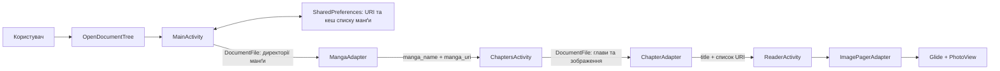

# Архітектура

## Огляд

Kiroku Manga Reader — одномодульний Android-застосунок на Kotlin із класичним
View-based UI. Архітектура проста й орієнтована на три послідовні екрани:

```text
MainActivity -> ChaptersActivity -> ReaderActivity
 бібліотека       список глав        читання сторінок
```

Окремих domain/data-шарів, ViewModel, бази даних або dependency injection у
поточній реалізації немає. Activities відповідають одночасно за UI, навігацію,
файлове сканування та формування моделей.

## Потік даних



1. `MainActivity` відкриває системний вибір директорії та зберігає read-дозвіл
   на вибраний URI.
2. На `Dispatchers.IO` коренева директорія перетворюється на список
   `MangaItem`.
3. URI кореневої директорії та отриманий список `MangaItem` зберігаються в
   `SharedPreferences`. Під час наступного запуску `MainActivity` відновлює
   список із кешу без повторного сканування.
4. URI та назва вибраної манґи передаються в `ChaptersActivity` через `Intent`.
5. `ChaptersActivity` шукає директорії глав. Якщо їх немає, зображення в
   директорії манґи утворюють одну главу.
6. Глави скануються паралельно, після чого `ChapterAdapter` показує їх список.
7. Назва глави та URI всіх сторінок передаються в `ReaderActivity`.
8. `ImagePagerAdapter` завантажує сторінки через Glide у `PhotoView`.

## Компоненти

| Компонент | Відповідальність |
| --- | --- |
| `MainActivity` | дозволи, вибір кореневої директорії, сканування й кешування списку манґи, навігація до глав |
| `MangaAdapter` | відображення списку `MangaItem` |
| `MangaItem` | назва манґи та URI її директорії |
| `ChaptersActivity` | сканування глав і сторінок, фільтрація зображень, навігація до читача |
| `ChapterAdapter` | відображення назв глав і кількості сторінок |
| `Chapter` | назва глави та список URI сторінок |
| `ReaderActivity` | ViewPager2, індикатор сторінки, fullscreen-панель, орієнтація |
| `ImagePagerAdapter` | завантаження сторінок, масштабування та обробка дотиків |

## Навігаційний контракт

Навігація реалізована через явні `Intent`.

| Перехід | Extras |
| --- | --- |
| `MainActivity` -> `ChaptersActivity` | `manga_name: String`, `manga_uri: String` |
| `ChaptersActivity` -> `ReaderActivity` | `title: String`, `images: ArrayList<String>` |

Ці ключі є неформальним контрактом між Activities. У разі розширення застосунку
їх доцільно винести в константи або типізовані navigation arguments.

## Конкурентність

- `MainActivity` сканує кореневу директорію на `Dispatchers.IO`.
- `ChaptersActivity` отримує список глав на `Dispatchers.IO`.
- Кожна директорія глави сканується окремим `async(Dispatchers.IO)`.
- Результати повертаються на `Dispatchers.Main` для оновлення адаптерів.
- Обидві Activities скасовують власний `CoroutineScope` в `onDestroy`.

## Структура проєкту

Нижче наведено структуру файлів, що зберігаються в репозиторії. Згенеровані
директорії на кшталт `.gradle/`, `.idea/`, `.kotlin/` та `app/build/` не є
частиною вихідного коду.

```text
kiroku-manga-reader/
├── app/
│   ├── build.gradle.kts                 # конфігурація Android-модуля та залежності
│   ├── proguard-rules.pro               # правила R8/ProGuard
│   └── src/
│       ├── androidTest/
│       │   └── java/com/example/mangareader/
│       │       └── ExampleInstrumentedTest.kt.bak
│       ├── main/
│       │   ├── AndroidManifest.xml       # дозволи, Activities, теми
│       │   ├── java/com/crypset/kiroku/mangareader/
│       │   │   ├── MainActivity.kt      # вибір і сканування бібліотеки
│       │   │   ├── MangaAdapter.kt      # список манґи
│       │   │   ├── ChaptersActivity.kt  # сканування та список глав
│       │   │   ├── ChapterAdapter.kt    # список глав
│       │   │   ├── ReaderActivity.kt    # екран читання
│       │   │   └── ImagePagerAdapter.kt # сторінки, Glide та PhotoView
│       │   └── res/
│       │       ├── drawable/             # фон панелі та launcher-вектори
│       │       ├── layout/
│       │       │   ├── activity_main.xml
│       │       │   ├── activity_chapters.xml
│       │       │   ├── activity_reader.xml
│       │       │   ├── item_chapter.xml
│       │       │   └── item_manga_page.xml
│       │       ├── mipmap-*/             # launcher-іконки різної щільності
│       │       ├── values/
│       │       │   ├── colors.xml
│       │       │   ├── strings.xml
│       │       │   └── themes.xml
│       │       └── xml/
│       │           ├── backup_rules.xml
│       │           └── data_extraction_rules.xml
│       └── test/
│           └── java/com/example/mangareader/
│               └── ExampleUnitTest.kt.bak
├── docs/
│   ├── README.md                         # огляд і використання
│   ├── DEVELOPMENT.md                    # інструкції для розробників
│   └── ARCHITECTURE.md                   # цей документ
├── gradle/
│   ├── libs.versions.toml                # каталог версій plugins/libraries
│   └── wrapper/
│       ├── gradle-wrapper.jar
│       └── gradle-wrapper.properties
├── .gitignore
├── build.gradle.kts                      # коренева конфігурація plugins
├── gradle.properties                     # глобальні параметри Gradle/AndroidX
├── gradlew                               # Gradle wrapper для Unix
├── gradlew.bat                           # Gradle wrapper для Windows
├── LICENSE
├── README.md
└── settings.gradle.kts                   # repositories, назва та модулі
```

## Ресурси інтерфейсу

| Layout | Призначення |
| --- | --- |
| `activity_main.xml` | заголовок, список манґи, progress bar і кнопка вибору директорії |
| `activity_chapters.xml` | список глав і progress bar |
| `activity_reader.xml` | ViewPager2 та компактна панель читача |
| `item_chapter.xml` | спільна картка для манґи й глави |
| `item_manga_page.xml` | одна сторінка з `PhotoView` |

## Межі та напрямки розвитку

Поточна структура добре підходить для невеликого локального читача, але зі
зростанням функціональності Activities стануть перевантаженими. Найприродніші
напрямки розвитку:

1. Винести сканування, natural sorting і перевірку форматів у окремий repository
   або service.
2. Перенести стан екранів у ViewModel і використовувати lifecycle-aware
   coroutines.
3. Перенести кеш бібліотеки з `SharedPreferences` і зберігати прогрес читання
   через DataStore або Room.
4. Передавати в читач ідентифікатор глави, а не весь список URI через Binder.
5. Централізувати рядки, кольори та розміри в Android resources.
6. Додати unit-тести для файлової логіки та UI/instrumented-тести основного
   сценарію.

